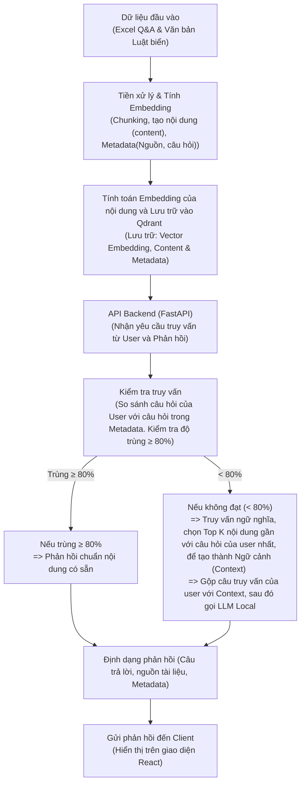

# MiniProj_RAG3_RAG6_LegalChatbot_

LỜI ĐẦU: GỬI LỜI CẢM ƠN CHÂN THÀNH ĐÊN CHÍNH CHỦ CỦA UI: https://github.com/phatjkk/nttu-chatbot - anh Phát ikkk

Support Project Graduation for 1 friend.  RAG on Legal Docs in vietnamese - xài LLMs 4omini - Deploy Server - Chạy with no Memory and Add Memory in the Future. --- - Phân vân là : lưu tài liệu nội bộ của nó trên qdant hay milvus (deploy database trên server luôn)  - Cân nhắc để có thể tích hợp mem0 và supabase vào làm memory  Cho cả chatbot và RAG 

# Changelog

## [v1.1] - 2025-03-16 - Từ 17h đến 23h30 = 6h30

### Added
- Integrated OpenWebUI and RAG3NTTU_RAG into a unified system
- Added dark mode support with automatic theme detection
- Created new project variant #1

### Technical
- Git tag: v1.1-16032025
- Command to push tag: `git push origin v1.1-16032025`

Link Demo: https://youtu.be/ZOTE_l9lsNI 

---
## Update: 1.2 - 11/04/2025
- Enhanced authentication flow with Supabase
- Dark mode optimized login/register UI
- Comprehensive logging system
- Environment variables management
  

---

# Model Offline 

## Tóm tắt

Trên một máy chỉ có GPU 8 GB VRAM, bạn hoàn toàn có thể chạy mượt các mô hình embedding và LLM 3 tỷ tham số (3 B) ở chế độ FP16, hoặc thậm chí LLM 7 B nếu dùng quantization 4 bit. Về embedding, `paraphrase-multilingual-mpnet-base-v2` (278 M tham số) chỉ chiếm khoảng 0.5 GB VRAM ở FP16, còn hai lựa chọn nhẹ hơn là MiniLM-L12-v2 (118 M tham số, \~0.24 GB VRAM) và MiniLM-L6-v2 (22.7 M tham số, \~0.045 GB VRAM). Về LLM, `Llama-3.2-3B-Instruct-Frog` ở FP16 cần \~6.5 GB VRAM; nếu xuống FP8 còn \~3.2 GB VRAM, vừa khít với 8 GB VRAM ([PromptLayer][1], [PromptLayer][2], [PromptLayer][3], [Stack Overflow][4], [Llama Ai Model][5], [Hugging Face Forums][6], [Hardware Corner][7]).

---

## 1. Điều kiện máy 8 GB GPU

* **VRAM khả dụng**: 8 GB
* **Target**: Chạy inference embedding + LLM 3 B với FP16, hoặc LLM 7 B khi dùng quantization 4 bit.
* **Lưu ý chung**: Giữ batch\_size ≤ 16, sử dụng FP16/FP8 để tiết kiệm VRAM, bật caching và tắt gradient.

---

## 2. Đề xuất Embedding

### 2.1. sentence-transformers/paraphrase-multilingual-mpnet-base-v2

* **Param**: 278 M → \~556 MB VRAM (FP16) ([PromptLayer][1])
* **Dimension**: 768 ([Hugging Face][8])
* **Hiệu năng GPU**: \~0.01 s/câu trên GTX 1650 (4 GB VRAM) với \~50–60 % utilization ([Stack Overflow][4])

### 2.2. Các option nhẹ hơn

* **paraphrase-multilingual-MiniLM-L12-v2**

  * Param: 118 M → \~236 MB VRAM (FP16) ([PromptLayer][2])
  * Dimension: 384 ([Hugging Face][9])
* **paraphrase-MiniLM-L6-v2**

  * Param: 22.7 M → \~45 MB VRAM (FP16) ([PromptLayer][3])
  * Dimension: 384 ([Hugging Face][10])

---

## 3. Đề xuất LLM cho RAG tiếng Việt

### 3.1. Llama-3.2-3B-Instruct-Frog

* **FP16**: \~6.5 GB VRAM ([Llama Ai Model][5])
* **FP8**: \~3.2 GB VRAM ([Llama Ai Model][5])
* **Ngữ cảnh**: 4 K tokens
* **Khuyến nghị**: Chạy FP16 nếu chỉ inference; nếu cần tiết kiệm VRAM, chuyển FP8.

### 3.2. 7 B-param Models (Ví dụ Vi-Qwen2-7B-RAG)

* **FP32**: \~56 GB VRAM (không khả thi)
* **AdaFactor (FP16-like)**: \~28 GB VRAM ([Hugging Face Forums][6])
* **Quantization 8 bit (bitsandbytes)**: \~14 GB VRAM ([Hugging Face Forums][6])
* **Quantization 4 bit**: \~3.2 GB VRAM ([Hugging Face Forums][6], [Hardware Corner][7])
* **Kết luận**: Với 8 GB VRAM, chỉ khả thi khi dùng 4 bit quantization.

---

## 4. Kết luận

* **Embedding**: Dùng `paraphrase-multilingual-mpnet-base-v2` (≈0.5 GB VRAM) để đạt độ chính xác cao; nếu cần nhẹ hơn, chọn MiniLM-L12-v2 (≈0.24 GB) hoặc MiniLM-L6-v2 (≈0.045 GB).
* **LLM**: Ưu tiên `Llama-3.2-3B-Instruct-Frog` ở FP16 (≈6.5 GB VRAM) hoặc FP8 (≈3.2 GB VRAM). **Chỉ** dùng 7 B-param models với 4 bit quantization.

Với cấu hình 8 GB GPU, bộ đôi (`paraphrase-multilingual-mpnet-base-v2` + `Llama-3.2-3B-Instruct-Frog`) ở chế độ FP16/FP8 sẽ đáp ứng tốt nhu cầu RAG tiếng Việt.

[1]: https://www.promptlayer.com/models/paraphrase-multilingual-mpnet-base-v2?utm_source=chatgpt.com "paraphrase-multilingual-mpnet-base-v2 - promptlayer.com"
[2]: https://www.promptlayer.com/models/paraphrase-multilingual-minilm-l12-v2?utm_source=chatgpt.com "paraphrase-multilingual-MiniLM-L12-v2 - promptlayer.com"
[3]: https://www.promptlayer.com/models/paraphrase-minilm-l6-v2?utm_source=chatgpt.com "paraphrase-MiniLM-L6-v2"
[4]: https://stackoverflow.com/questions/74770033/increase-utilization-of-gpu-for-sentence-transformer-inference?utm_source=chatgpt.com "Increase utilization of GPU for Sentence Transformer inference"
[5]: https://llamaimodel.com/requirements-3-2/?utm_source=chatgpt.com "Llama 3.2 Requirements [What you Need to Use It?]"
[6]: https://discuss.huggingface.co/t/llama-7b-gpu-memory-requirement/34323?utm_source=chatgpt.com "LLaMA 7B GPU Memory Requirement - Hugging Face Forums"
[7]: https://www.hardware-corner.net/guides/hardware-for-mistral-llm/?utm_source=chatgpt.com "Choosing Hardware for Running Mistral LLM (7B) Locally"
[8]: https://huggingface.co/sentence-transformers/paraphrase-multilingual-mpnet-base-v2?utm_source=chatgpt.com "sentence-transformers/paraphrase-multilingual-mpnet-base-v2"
[9]: https://huggingface.co/sentence-transformers/paraphrase-multilingual-MiniLM-L12-v2?utm_source=chatgpt.com "sentence-transformers/paraphrase-multilingual-MiniLM-L12-v2"
[10]: https://huggingface.co/sentence-transformers/paraphrase-MiniLM-L6-v2?utm_source=chatgpt.com "sentence-transformers/paraphrase-MiniLM-L6-v2 - Hugging Face"
