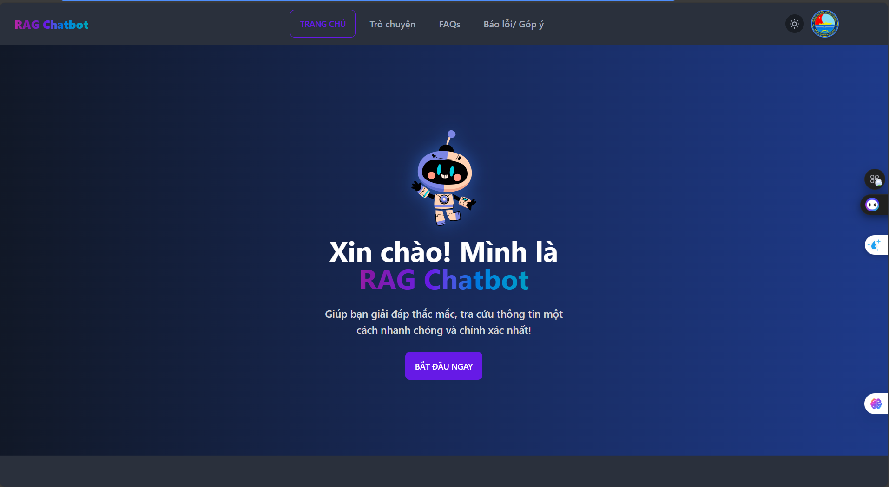

# MiniProj_RAG3_RAG6_LegalChatbot_

LỜI ĐẦU: GỬI LỜI CẢM ƠN CHÂN THÀNH ĐÊN CHÍNH CHỦ CỦA UI: https://github.com/phatjkk/nttu-chatbot - anh Phát ikkk

Support Project Graduation for 1 friend.  RAG on Legal Docs in vietnamese - xài LLMs 4omini - Deploy Server - Chạy with no Memory and Add Memory in the Future. --- - Phân vân là : lưu tài liệu nội bộ của nó trên qdant hay milvus (deploy database trên server luôn)  - Cân nhắc để có thể tích hợp mem0 và supabase vào làm memory  Cho cả chatbot và RAG 

# Changelog

## [v1.1] - 2025-03-16 - Từ 17h đến 23h30 = 6h30

### Added
- Integrated OpenWebUI and RAG3NTTU_RAG into a unified system
- Added dark mode support with automatic theme detection
- Created new project variant #1

### Technical
- Git tag: v1.1-16032025
- Command to push tag: `git push origin v1.1-16032025`

Link Demo: https://youtu.be/ZOTE_l9lsNI 

---
## Update: 1.2 - 11/04/2025
- Enhanced authentication flow with Supabase
- Dark mode optimized login/register UI
- Comprehensive logging system
- Environment variables management
  

