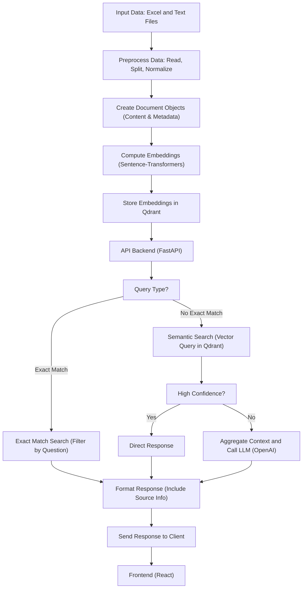

```mermaid
flowchart TD
    A["Input Data: Excel and Text Files"]
    B["Preprocess Data: Read, Split, Normalize"]
    C["Create Document Objects (Content & Metadata)"]
    D["Compute Embeddings (Sentence-Transformers)"]
    E["Store Embeddings in Qdrant"]
    F["API Backend (FastAPI)"]
    G["Query Type?"]
    H["Exact Match Search (Filter by Question)"]
    I["Semantic Search (Vector Query in Qdrant)"]
    J["High Confidence?"]
    K["Direct Response"]
    L["Aggregate Context and Call LLM (OpenAI)"]
    M["Format Response (Include Source Info)"]
    N["Send Response to Client"]
    O["Frontend (React)"]

    A --> B
    B --> C
    C --> D
    D --> E
    E --> F
    F --> G
    G -- "Exact Match" --> H
    G -- "No Exact Match" --> I
    H --> M
    I --> J
    J -- "Yes" --> K
    J -- "No" --> L
    K --> M
    L --> M
    M --> N
    N --> O
```