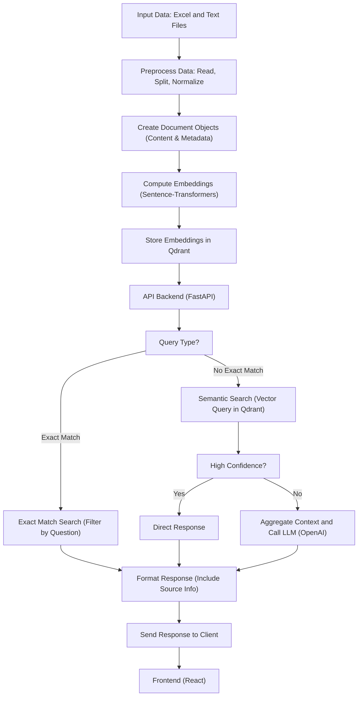
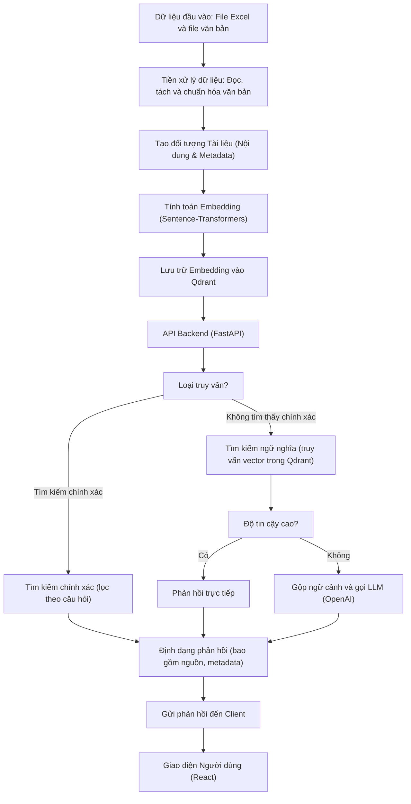

Dưới đây là sơ đồ pipeline bằng Mermaid được chuyển hoàn toàn sang tiếng Việt, mô tả chi tiết toàn bộ luồng xử lý của hệ thống:

### Giải thích sơ đồ:
1. **Dữ liệu đầu vào:**  
   Dữ liệu được thu thập từ các file Excel chứa cặp câu hỏi – đáp án và các file văn bản.

2. **Tiền xử lý dữ liệu:**  
   Dữ liệu được đọc vào, sau đó được tách thành các đoạn văn bản theo tiêu chí định sẵn và được chuẩn hóa để đảm bảo tính nhất quán.

3. **Tạo đối tượng Tài liệu:**  
   Mỗi đoạn văn bản được chuyển đổi thành đối tượng tài liệu, với thông tin bao gồm nội dung và metadata (ví dụ như nguồn dữ liệu, câu hỏi gốc nếu có).

4. **Tính toán Embedding:**  
   Sử dụng mô hình chuyển đổi ngôn ngữ (ví dụ, sentence-transformers) để chuyển văn bản thành vector embedding đại diện cho ý nghĩa ngữ cảnh.

5. **Lưu trữ Embedding vào Qdrant:**  
   Các vector embedding được lưu trữ vào cơ sở dữ liệu vector Qdrant để phục vụ việc truy vấn sau này.

6. **API Backend (FastAPI):**  
   Hệ thống backend xử lý các yêu cầu truy vấn từ phía người dùng thông qua API được triển khai bằng FastAPI.

7. **Xác định loại truy vấn:**  
   Hệ thống xác định xem truy vấn của người dùng có phù hợp với tìm kiếm chính xác hay cần sử dụng tìm kiếm ngữ nghĩa.

8. **Tìm kiếm chính xác:**  
   Nếu có, hệ thống dùng bộ lọc trên câu hỏi để truy xuất tài liệu khớp hoàn toàn.

9. **Tìm kiếm ngữ nghĩa:**  
   Nếu không tìm thấy kết quả chính xác, câu hỏi của người dùng sẽ được chuyển đổi thành vector embedding và so sánh với các vector trong Qdrant.

10. **Kiểm tra độ tin cậy:**  
    Nếu kết quả từ truy vấn ngữ nghĩa đạt được điểm tin cậy cao, hệ thống có thể trả về phản hồi trực tiếp; nếu không, các đoạn văn bản liên quan sẽ được gộp làm ngữ cảnh và gửi kèm với yêu cầu gọi LLM (OpenAI) để sinh ra phản hồi.

11. **Định dạng phản hồi:**  
    Kết quả, bao gồm các thông tin nguồn và metadata, được định dạng lại theo chuẩn trước khi gửi về cho client.

12. **Gửi phản hồi đến Client:**  
    Phản hồi đã định dạng được gửi về cho phía client.

13. **Giao diện Người dùng (React):**  
    Frontend (được xây dựng bằng React) nhận và hiển thị phản hồi, đồng thời cung cấp các giao diện như Chat, FAQ, Issue,… để người dùng tương tác.

Sơ đồ pipeline này cung cấp cái nhìn tổng quan về toàn bộ quy trình xử lý từ lúc nhập liệu cho đến khi phản hồi hiển thị cho người dùng, đảm bảo rằng các bước được tích hợp liền mạch nhằm mang lại trải nghiệm chính xác và nhanh chóng.