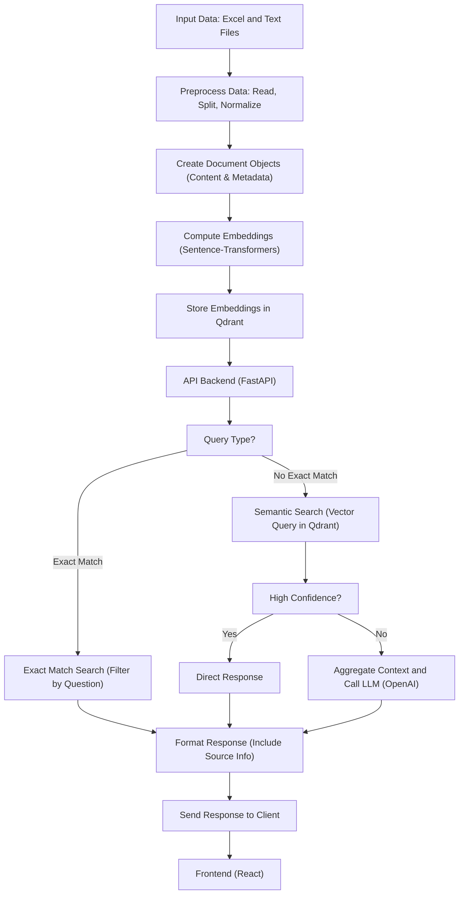
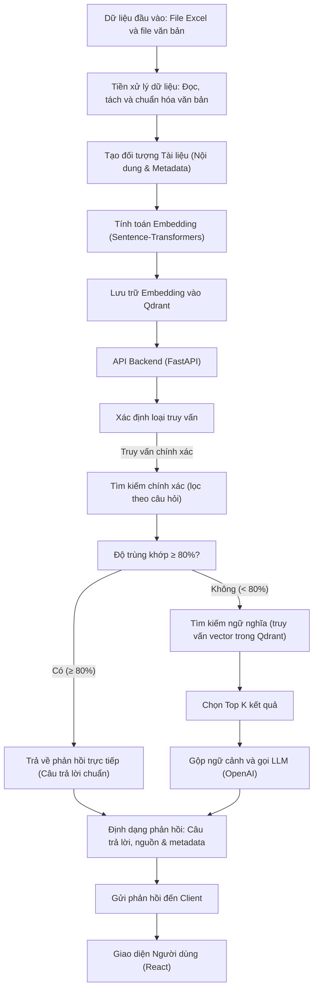
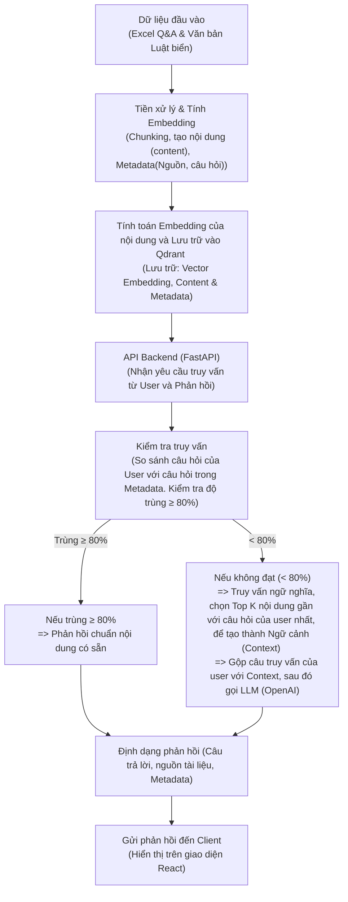

---

# Update
Dưới đây là sơ đồ pipeline bằng Mermaid (đã chuyển hoàn toàn sang tiếng Việt) với điều kiện so sánh độ trùng khớp:

- Nếu tỷ lệ trùng khớp từ tìm kiếm chính xác ≥ 80% thì trả về ngay câu trả lời chuẩn (đã được chuẩn bị sẵn) kèm theo thông tin nguồn và metadata.
- Nếu tỷ lệ trùng khớp < 80% thì chuyển sang sử dụng tìm kiếm ngữ nghĩa: chọn Top K kết quả, gộp ngữ cảnh và gọi LLM (OpenAI) để sinh ra phản hồi, sau đó định dạng và gửi về phía client.

Dưới đây là mã sơ đồ:

### Giải thích sơ đồ:
1. **Dữ liệu đầu vào:**  
   - Hệ thống nhận dữ liệu từ file Excel chứa cặp câu hỏi – đáp án và các file văn bản khác.

2. **Tiền xử lý dữ liệu:**  
   - Đọc dữ liệu, tách các đoạn văn bản theo tiêu chí định sẵn và chuẩn hóa dữ liệu.

3. **Tạo đối tượng Tài liệu:**  
   - Mỗi đoạn văn bản được chuyển thành một đối tượng tài liệu với các trường: nội dung (page_content) và metadata (nguồn, câu hỏi, …).

4. **Tính toán Embedding:**  
   - Sử dụng mô hình chuyển đổi ngôn ngữ (sentence-transformers) để chuyển nội dung thành vector embedding thể hiện ý nghĩa ngữ cảnh.

5. **Lưu trữ Embedding vào Qdrant:**  
   - Các vector embedding được lưu trữ trong Qdrant để phục vụ truy vấn sau này.

6. **API Backend (FastAPI):**  
   - Hệ thống backend nhận yêu cầu từ phía người dùng và xác định loại truy vấn.

7. **Xác định loại truy vấn:**  
   - Hệ thống thực hiện tìm kiếm chính xác dựa trên bộ lọc theo câu hỏi.

8. **So sánh độ trùng khớp:**  
   - Nếu tỷ lệ trùng khớp từ tìm kiếm chính xác đạt ≥ 80% thì hệ thống sẽ trả về ngay câu trả lời chuẩn đã được chuẩn bị sẵn (kèm theo thông tin nguồn và metadata).

9. **Tìm kiếm ngữ nghĩa:**  
   - Nếu không đạt tỷ lệ trùng khớp ≥ 80%, hệ thống sẽ thực hiện tìm kiếm ngữ nghĩa bằng cách tạo embedding cho câu hỏi và so sánh với các vector trong Qdrant, sau đó chọn ra Top K kết quả.

10. **Gộp ngữ cảnh và gọi LLM:**  
    - Các kết quả Top K được gộp thành một context chung và được gửi kèm với câu truy vấn tới LLM (ví dụ: OpenAI) để sinh ra câu trả lời tự động.

11. **Định dạng phản hồi:**  
    - Câu trả lời cuối cùng được định dạng lại bao gồm cả thông tin nguồn và metadata nếu cần.

12. **Gửi phản hồi đến Client:**  
    - Phản hồi được gửi về cho client để hiển thị qua giao diện người dùng (React).

Sơ đồ này giúp minh họa toàn bộ quy trình xử lý trong hệ thống từ lúc nhận dữ liệu cho đến khi trả về câu trả lời hoàn chỉnh cho người dùng.

---

# Sửa tay 

